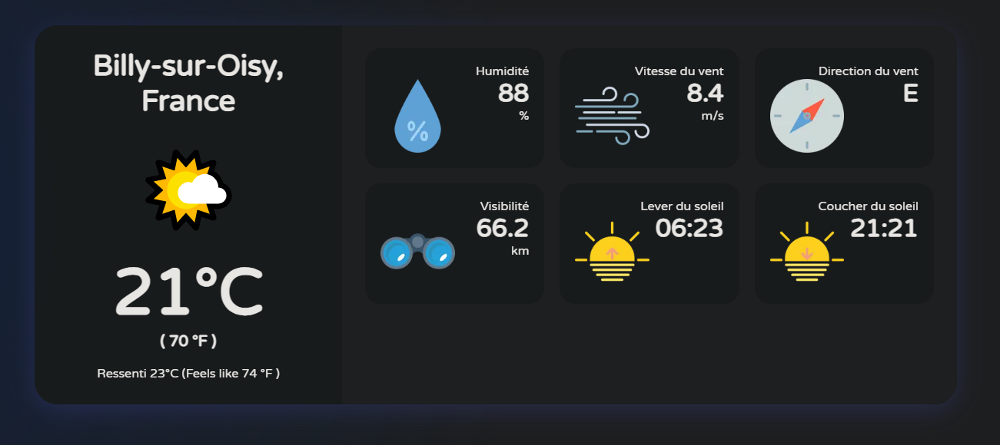

# Application Meteo Simplon

## Features

1. Ville et Pays

2. Température, ressenti et humidité

3. Vitesse du vent et direction

4. Lever/coucher du soleil

5. Gestion des erreurs et chargement des info

## Installation

1. `git clone https://github.com/Kinuso/Brief-projet-CDA`

2. `cd Brief-projet-CDA`

3. `npm install`

4. `Créer le .env.local en suivant les instructions du .env.exemple`

5. `npm run dev`
